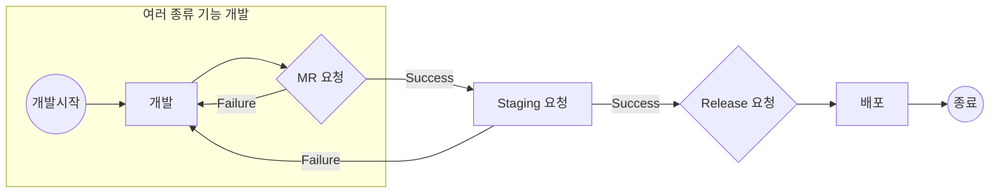

# 🧭 Java 프로젝트 변경 이력 및 버전 관리 전략 가이드 (v7)

## 전략

### 📂 브랜치 전략

| 브랜치       | 목적 | 버전 형태 |
|-------------|------|-----------|
| `feat/*` | 기능 단위 개발       | `1.3.1-feat-abc-SNAPSHOT` |
| `fix/*`     | 버그 수정 개발       | `1.3.1-fix-def-SNAPSHOT` |
| `stg/*` | 릴리즈 후보 준비, QA | `1.3.1-stg-next-SNAPSHOT` |
| `master`    | 운영 반영, 태그 대상 | `1.3.1` (릴리즈 확정 시점) |

브랜치명으로 버전정보를 직접 기술하지 않으며, 버전은 commit message 기반 자동화를 추구한다.

### Semantic Versioning

Semantic Versioning은 소프트웨어 버전 번호를 체계적으로 관리하기 위한 규칙입니다.

#### 버전 구조

`MAJOR.MINOR.PATCH` 형식으로 구성됩니다.

| 구성요소 | 설명 | 증가 조건 |
|---------|------|-----------|
| MAJOR | 주 버전 | 이전 버전과 호환되지 않는 API 변경 시 |
| MINOR | 부 버전 | 이전 버전과 호환되는 새로운 기능 추가 시 |
| PATCH | 수 버전 | 이전 버전과 호환되는 버그 수정 시 |

#### 추가 식별자

- 개발 버전: `-SNAPSHOT` 접미사 사용 (예: `1.3.1-SNAPSHOT`)
- 브랜치별 식별: `-feat-*`, `-fix-*`, `-stg-*` 등 추가 (예: `1.3.1-feat-login-SNAPSHOT`)

#### 버전 증가 예시

| 변경 유형 | 이전 버전 | 새 버전 |
|-----------|-----------|----------|
| API 호환성 깨짐 | 1.3.1 | 2.0.0 |
| 새 기능 추가 | 1.3.1 | 1.4.0 |
| 버그 수정 | 1.3.1 | 1.3.2 |


### Conventional Commits

Conventional Commits는 커밋 메시지를 구조화된 형식으로 작성하여 자동화된 버전 관리와 CHANGELOG 생성을 용이하게 하는 규칙입니다. 
 이 규칙은 커밋 메시지를 일관되게 작성하여, 프로젝트의 변경 이력을 명확하게 추적하고, 자동화 도구와의 연계를 통해 버전 관리 및 
 릴리즈 프로세스를 효율화합니다.

#### 기본 형식

커밋 메시지는 다음과 같은 형식을 따릅니다:

```
<type>(<scope>): <subject>

<body>

<footer>
```

- `type`: 커밋의 목적을 나타내며, 일반적으로 `feat`, `fix`, `docs`, `style`, `refactor`, `test`, `chore` 등이 사용됩니다.
- `scope`: 선택 사항으로, 변경 사항의 범위나 모듈을 명시합니다.
- `subject`: 간결한 변경 요약으로, 소문자로 시작하며 마침표를 사용하지 않습니다.
- `body`: 선택 사항으로, 변경 사항에 대한 자세한 설명을 포함합니다.
- `footer`: 선택 사항으로, `BREAKING CHANGE`나 이슈 트래커 ID 등을 명시합니다.

#### 예시

```
feat(auth): 로그인 2FA 인증 추가 (#123)
fix(api): 응답 코드 수정 오류 해결 (#124)
docs(readme): 프로젝트 소개 갱신
refactor(service): 중복 코드 제거
chore(ci): GitLab 파이프라인 병렬 처리 추가
```

#### 버전 결정 규칙

Conventional Commits는 커밋 메시지를 분석하여 자동으로 버전을 증가시킵니다. 주요 규칙은 다음과 같습니다:

- `fix`: 패치 버전 증가 (x.y.**z**)
- `feat`: 마이너 버전 증가 (x.**y**.z)
- `feat!`, `fix!`: 새로운 기능 추가 및 버그픽스와 함께 하위 호환성을 깨는 변경이 있을 때 사용하며, 메이저 버전 증가를 유발합니다.
- `BREAKING CHANGE`: 메이저 버전 증가 (**x**.y.z)

이 규칙을 통해 프로젝트의 버전이 자동으로 관리되며, CHANGELOG가 자동으로 생성됩니다.

## 도구

프로젝트 변경 이력 및 버전 관리 전략을 구현하기 위한 주요 도구들의 특징과 환경 설정, 사용법, 주의사항을 설명합니다.

### 도구 선택 기준

프로젝트의 버전 관리와 변경 이력 추적을 위해 다음과 같은 기준으로 도구를 선택했습니다:

- Git 기반 버전 관리 지원
- CI/CD 파이프라인 통합 용이성
- 자동화된 버전 관리 및 태깅 지원
- 폐쇄망 환경 지원
- 사용자 친화적인 인터페이스
- 안정적인 커뮤니티 지원

### 주요 도구 구성

| 도구 | 주요 기능 | 사용 목적 |
|------|-----------|-----------|
| GitLab | 소스 관리, CI/CD, MR | 코드 저장소 및 자동화 파이프라인 |
| jgitver-maven-plugin | 자동 버전 채번 | Git 기반 버전 자동화 |
| commit-and-tag-version | 버전 태깅, CHANGELOG | 릴리즈 자동화 |


### GitLab

GitLab은 Git 호스팅 및 CI/CD를 위한 플랫폼으로, 브랜치 전략과 릴리즈 자동화를 지원합니다.

#### GitLab Merge Request

GitLab의 Merge Request(MR) 기능을 사용하여 코드 리뷰 및 병합을 관리합니다. MR 생성 시 자동으로 GitLab CI 파이프라인이 실행되어 
다음과 같은 테스트를 수행할 수 있습니다:

- 단위 테스트 실행
- 코드 스타일 검사
- 보안 취약점 스캔
- 빌드 검증
- 통합 테스트

#### GitLab CI 구성 방법

GitLab CI/CD는 GitLab에서 제공하는 지속적 통합 및 지속적 배포(Continuous Integration and Continuous Deployment) 도구입니다.
 이를 통해 개발자는 코드 변경 사항을 자동으로 빌드, 테스트, 배포할 수 있으며, 소프트웨어 개발 라이프사이클을 자동화하여 효율성을
 높일 수 있습니다. GitLab CI/CD는 `.gitlab-ci.yml` 파일을 기반으로 파이프라인을 정의하고, 각 단계에서 수행할 작업을 설정합니다.
 이를 통해 코드 품질을 유지하고, 배포 프로세스를 간소화할 수 있습니다.

GitLab CI/CD는 `.gitlab-ci.yml` 파일을 통해 구성됩니다. 이 파일은 프로젝트의 루트 디렉토리에 위치하며, 파이프라인의 각 단계를 
 정의합니다. 기본적인 구성 요소는 다음과 같습니다:

- **stages**: 파이프라인의 단계들을 정의합니다. 예를 들어, `build`, `test`, `deploy` 단계가 있을 수 있습니다.
- **jobs**: 각 단계에서 수행할 작업을 정의합니다. 각 job은 특정 stage에 속하며, 스크립트를 통해 실행됩니다.
- **script**: job에서 실행할 명령어를 정의합니다. 예를 들어, `mvn clean install`과 같은 명령어가 포함될 수 있습니다.
- **only**: 특정 브랜치나 태그에 대해서만 job을 실행하도록 설정할 수 있습니다.
- **when**: job의 실행 시점을 정의합니다. 기본값은 `on_success`이며, `manual`로 설정하면 수동으로 실행할 수 있습니다.

예시:

```yaml
stages:
  - build
  - test
  - deploy

build_job:
  stage: build
  script:
    - mvn clean install
  only:
    - master

test_job:
  stage: test
  script:
    - mvn test
  only:
    - merge_requests

deploy_job:
  stage: deploy
  script:
    - ./deploy.sh
  only:
    - tags
```

이 예시는 `master` 브랜치에서 빌드, 병합 요청에서 테스트, 태그에서 배포를 수행하는 파이프라인을 정의합니다. 각 job은 독립적으로
 실행되며, 필요에 따라 병렬로 실행될 수도 있습니다.

### jgitver-maven-plugin

[jgitver-maven-plugin](https://github.com/jgitver/jgitver-maven-plugin) 은 Git 저장소의 상태에 따라 Maven 프로젝트의 버전을
자동으로 채번하는 도구입니다. 이 플러그인은 Git 태그와 커밋을 기반으로 버전을 생성하여, 수동으로 버전을 관리할 필요 없이 일관된 
버전 관리를 가능하게 합니다.

#### 주요 특징

- **자동 버전 채번**: Git 커밋과 태그를 기반으로 버전을 자동으로 생성합니다.
- **Maven 통합**: Maven 빌드 프로세스에 쉽게 통합되어, 빌드 시 자동으로 버전이 반영됩니다.
- **유연한 설정**: 다양한 설정 옵션을 통해 프로젝트에 맞게 커스터마이징 가능합니다.

#### 사용 방법

1. `pom.xml` 파일에 `jgitver-maven-plugin`을 추가합니다.
2. profile 을 local_enforce 로 설정하여 로컬 환경에서 자동으로 버전을 채번합니다.
2. Git 저장소의 상태에 따라 자동으로 버전이 채번됩니다.
3. Maven 빌드 시 자동으로 버전이 반영됩니다.

예시 설정:

```xml
<build>
  <plugins>
    <plugin>
      <groupId>fr.brouillard.oss</groupId>
      <artifactId>jgitver-maven-plugin</artifactId>
      <version>1.0.0</version>
      <extensions>true</extensions>
    </plugin>
  </plugins>
</build>
```

이 설정을 통해 Maven 빌드 프로세스에 `jgitver-maven-plugin`이 통합되며, Git 저장소의 상태에 따라 자동으로 버전이 채번됩니다.
`extensions`를 `true`로 설정하여 Maven 빌드 시 플러그인이 자동으로 로드되도록 합니다.

#### 주의사항

- **Git 상태 의존성**: Git 저장소의 상태에 따라 버전이 결정되므로, 커밋 및 태그 관리에 주의해야 합니다.
- **Maven 빌드 환경**: Maven 빌드 환경에서만 동작하므로, 다른 빌드 도구와의 호환성을 고려해야 합니다.
- **설정 파일 관리**: `jgitver.config.yml` 파일을 통해 설정을 관리하며, 프로젝트에 맞게 적절히 설정해야 합니다.

#### jgitver.config.yml 작성 방법

`jgitver.config.yml` 파일은 `jgitver-maven-plugin`의 동작을 제어하는 설정 파일로, 프로젝트의 루트 디렉토리에 위치합니다. 
  이 파일을 통해 버전 생성 정책을 정의할 수 있습니다. 기본적인 설정 항목은 다음과 같습니다:

- **policy**: 버전 생성 정책을 정의합니다. 예를 들어, `SIMPLE` 정책은 간단한 버전 생성 방식을 사용합니다.
- **nonQualifierBranches**: 특정 브랜치에서 접미사를 사용하지 않도록 설정합니다. 일반적으로 `master` 브랜치를 지정합니다.
- **useDistance**: 커밋 거리 정보를 버전에 포함할지 여부를 설정합니다.
- **useGitCommitId**: Git 커밋 ID를 버전에 포함할지 여부를 설정합니다.
- **useDirty**: 작업 디렉토리가 수정된 경우 버전에 표시할지 여부를 설정합니다.
- **autoIncrementPatch**: 패치 버전을 자동으로 증가시킬지 여부를 설정합니다.

예시 설정:

```yaml
policy: SIMPLE
nonQualifierBranches:
  - master
useDistance: true
useGitCommitId: false
useDirty: true
autoIncrementPatch: true
```

#### IntelliJ 적용하는 방법

IntelliJ에서 `jgitver-maven-plugin`을 적용하려면 다음 단계를 따릅니다:

1. **프로젝트 열기**: IntelliJ에서 해당 Maven 프로젝트를 엽니다.
2. **Maven 설정 확인**: `pom.xml` 파일에 `jgitver-maven-plugin`이 올바르게 설정되어 있는지 확인합니다.
3. **Maven 패널 열기**: IntelliJ의 우측에 있는 Maven 패널을 엽니다. 여기서 프로젝트의 Maven 목표를 관리할 수 있습니다.
4. **프로젝트 리프레시**: Maven 패널에서 'Reload All Maven Projects' 버튼을 클릭하여 프로젝트 설정을 갱신합니다. 이는 
  `jgitver-maven-plugin` 설정을 IntelliJ에 반영하는 데 필요합니다.
5. **빌드 실행**: Maven 패널에서 `install` 또는 `package` 목표를 실행하여 빌드를 수행합니다. 이 과정에서
  `jgitver-maven-plugin`이 자동으로 버전을 채번합니다.
6. **버전 확인**: 빌드가 완료되면, `target` 디렉토리 내의 생성된 아티팩트의 버전을 확인하여 `jgitver-maven-plugin`이 올바르게
  작동했는지 검증합니다.

이 과정을 통해 IntelliJ에서 `jgitver-maven-plugin`을 활용하여 자동 버전 채번을 적용할 수 있습니다.

### commit-and-tag-version

[commit-and-tag-version](https://github.com/commit-and-tag-version/commit-and-tag-version)은 Conventional Commits 규칙을 
  기반으로 버전을 자동으로 증가시키고, CHANGELOG를 생성하며, Git 커밋과 태그를 자동으로 관리하는 도구입니다. 이 도구는 프로젝트의
  릴리즈 프로세스를 자동화하여, 수동으로 버전을 관리할 필요 없이 일관된 릴리즈를 가능하게 합니다. `commit-and-tag-version`은 특히
  폐쇄망 환경에서도 수작업 설치가 가능하도록 설계되어 있으며, 다양한 CI/CD 환경에 쉽게 통합될 수 있습니다.


#### 사용 방법

```bash
npx commit-and-tag-version
```

#### 옵션 사용 예제

1. **CHANGELOG 생성**: `-c` 또는 `--changelog` 옵션을 사용하여 CHANGELOG 파일을 생성합니다.

   ```bash
   npx commit-and-tag-version -c
   ```

2. **릴리즈 태그 생성**: `-t` 또는 `--tag` 옵션을 사용하여 릴리즈 태그를 생성합니다.

   ```bash
   npx commit-and-tag-version -t
   ```

3. **커밋 메시지 지정**: `-m` 또는 `--message` 옵션을 사용하여 릴리즈 커밋 메시지를 지정합니다.

   ```bash
   npx commit-and-tag-version -m "chore(release): 새로운 버전 릴리즈"
   ```

4. **특정 브랜치에서 릴리즈**: `-b` 또는 `--branch` 옵션을 사용하여 특정 브랜치에서 릴리즈를 수행합니다.

   ```bash
   npx commit-and-tag-version -b stg/1.0.0
   ```

5. **특정 버전으로 릴리즈**: `-r` 또는 `--release-as` 옵션을 사용하여 특정 버전으로 릴리즈를 수행합니다.

   ```bash
   npx commit-and-tag-version -r 1.2.3
   ```

6. **드라이 런**: `-d` 또는 `--dry-run` 옵션을 사용하여 실제 릴리즈를 수행하지 않고 시뮬레이션합니다.

   ```bash
   npx commit-and-tag-version -d
   ```

이 예제들은 `commit-and-tag-version`을 사용하여 다양한 시나리오에서 릴리즈를 자동화하는 방법을 보여줍니다. 각 옵션을 적절히 
 조합하여 프로젝트의 릴리즈 프로세스를 효율적으로 관리할 수 있습니다.

#### 폐쇄망 오프라인 설치 방법

1. **Node.js 설치**:
   - 인터넷이 연결된 환경에서 Node.js 설치 파일을 다운로드합니다.
   - [Node.js 공식 웹사이트](https://nodejs.org/)에서 운영 체제에 맞는 설치 파일을 선택하여 다운로드합니다.
   - 다운로드한 설치 파일을 USB 드라이브나 다른 매체를 사용하여 폐쇄망 환경으로 이동합니다.
   - 폐쇄망 환경에서 설치 파일을 실행하여 Node.js를 설치합니다.

2. **필요한 패키지 다운로드**:
   - 인터넷이 연결된 환경에서 `commit-and-tag-version`과 그 의존성을 다운로드합니다.
   - `npm pack` 명령어를 사용하여 패키지를 로컬에 저장합니다.

   ```bash
   npm pack commit-and-tag-version
   ```

   - 이 명령어는 현재 디렉토리에 `commit-and-tag-version-x.y.z.tgz` 파일을 생성합니다.

3. **의존성 패키지 다운로드**:
   - `commit-and-tag-version`의 의존성 목록을 확인하고, 각 의존성에 대해 `npm pack`을 사용하여 다운로드합니다.
   - 의존성 목록은 `package.json` 파일의 `dependencies` 섹션에서 확인할 수 있습니다.

4. **폐쇄망 환경으로 파일 이동**:
   - 다운로드한 모든 `.tgz` 파일을 USB 드라이브나 다른 매체를 사용하여 폐쇄망 환경으로 이동합니다.

5. **폐쇄망 환경에서 설치**:
   - 폐쇄망 환경의 터미널에서 각 `.tgz` 파일을 설치합니다.

   ```bash
   npm install ./commit-and-tag-version-x.y.z.tgz
   ```

   - 의존성 패키지들도 동일한 방식으로 설치합니다.

6. **설치 확인**:
   - 설치가 완료되면, `commit-and-tag-version` 명령어가 정상적으로 작동하는지 확인합니다.

   ```bash
   npx commit-and-tag-version --version
   ```

이 과정을 통해 폐쇄망 환경에서도 `commit-and-tag-version`을 설치하고 사용할 수 있습니다. 필요한 모든 패키지를 사전에 다운로드하고,
 의존성까지 포함하여 설치하는 것이 중요합니다.


## CICD 라이프 사이클


* 개발 : 개발 요건별 feat/* 또는 fix/* 브랜치를 생성한다.
* MR 요청 : feat/* 또는 fix/* 를 stg/* 브랜치로 병합 후 테스트
* Staging 요청 : stg/* 를 master 브랜치로 병합 후 테스트
* Release 요청 : CHANGELOG 생성 및 Commit 과 태깅 후 Deploy 


### 개발 시작

1. Issue 등록: Gitlab/issue 를 등록, 변경 요건을 정리
2. 브랜치 생성: master 브랜치로 부터 fix/* 또는 feat/* 브랜치를 생성

### 개발 및 versioning

1. 로컬 개발 환경에 생성된 브랜치를 check out
2. `mvn validate` 를 실행하면, jgitver-maven-plugin 이 버전을 계산하여 생성한다.
3. 변경 내용을 conventional commit 규칙에 맞게 작성한다.

### 스테이징 MR 및 versioning

1. 다음 배포를 위한 stg/* 브랜치가 없다면 생성
2. feat/* 또는 fix/* 브랜치를 stg/* 브랜치로 Merge Request 생성
3. 인스펙션 후 Approve 버튼을 클릭하면, gitlab runner 가 머지소스로 `mvn verify` 를 수행 
4. 테스트 성공이면 머지를 완료
5. 테스트 실패이면 돌아가 수정 후 다시 테스트를 수행

### 릴리즈 사전 검증 + CHANGELOG 생성 및 태깅

1. Release 요청되면, stg/* 브랜치를 master 브랜치로 Merge Request 생성
2. 인스펙션 후 Approve 버튼을 클릭하면, gitlab runner 가 머지소스로 `mvn verify` 를 수행 
3. 테스트 성공이면 `commit-and-tag-version` 을 실행하여 CHANGELOG 생성 및 태깅
4. 테스트 실패이면 수정 후 다시 테스트를 수행

### 배포

1. master 브랜치 `mvn deploy` 를 실행하여 배포


## 기대효과 및 주의사항

### 기대효과

이 전략을 통해 일관된 버전 관리와 효율적인 릴리즈 프로세스를 기대할 수 있습니다.

### 주의사항

각 단계에서의 주의사항을 명시하여, 예상치 못한 오류를 방지합니다. 